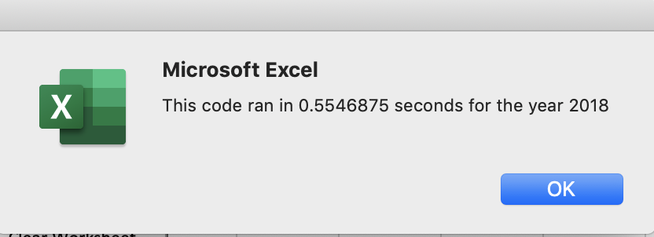
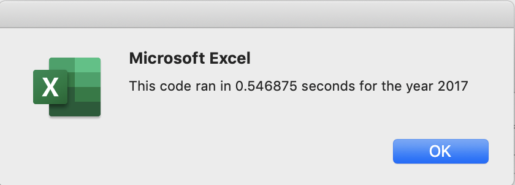
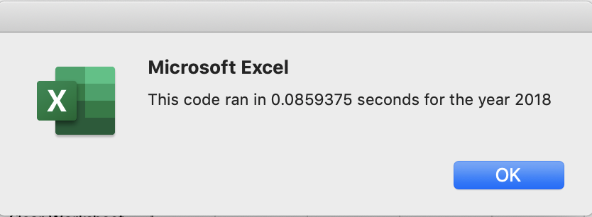
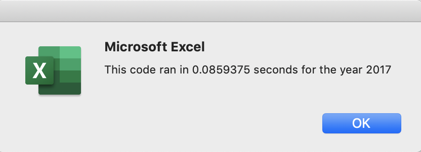

# Module-2-Challenge

## Overview of Project
-In this project I refracted the code to run more efficently allowing the macro to run faster and to run better at scale. Using the code from the module we took a slightly different approach by using the tickerIndex to better output the data instead of nested If-then statments with in the code from the module.

### Results
-As seen in the photos below,the first ones being from the old macro and the next ones being from the refracted code, there is a significant percentage decrease in he amonunt of time it takes to run. An added bonus is that it is less lines and more straight forward. The second code would be much easier to manipulate if needed to be changed. Accuracy is also key here and we recieved the same results with both codes.

## Analysis and Challenges

### Analysis of Outcomes Based on Launch Date

### Analysis of Outcomes Based on Goals

### Challenges and Difficulties Encountered

## Results

